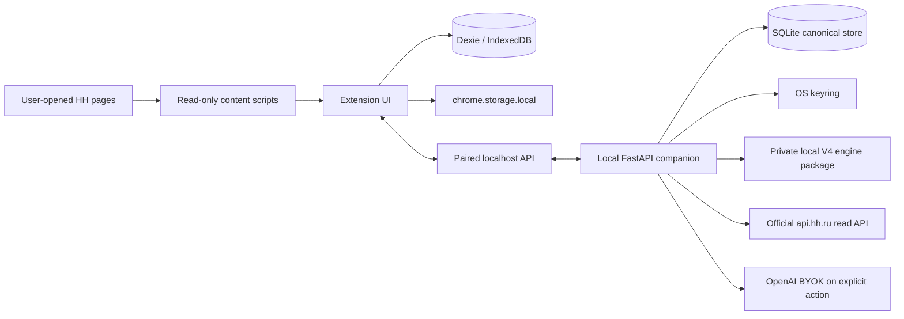

# VacancyPilot

Local-first, human-controlled HH.ru job-search copilot for read-only vacancy intake, explainable analysis, evidence-aware cover letters, application preparation and tracking, and descriptive conversion feedback.

No auto-apply. No hidden browser-side HH requests. No external recruiter or follow-up sending.

[](https://github.com/iurii-izman/VacancyPilot/actions/workflows/ci.yml)
[](https://www.typescriptlang.org/)
[](https://react.dev/)
[](https://wxt.dev/)
[](https://developer.chrome.com/docs/extensions/mv3/intro/)

## Status

**Pre-release / personal dogfood.** R5 is accepted and pushed; R5.1 Project Memory Lite is accepted and pushed; dependency maintenance is merged. Feature development is frozen while real usage evidence is collected. VacancyPilot is not published as a Chrome Web Store release.

“Personal dogfood” describes current product use, not repository visibility: this GitHub repository is public, while the private V4 engine package and real candidate knowledge remain outside it.

## What It Does Today

- Reads visible vacancy and search-card data from HH.ru pages the user opened.
- Uses the official HH read-only API through the optional local companion in Ops Mode.
- Manages Search Profiles and deterministic Stage A triage.
- Runs evidence-aware Full V4 analysis when the private local engine package and explicit AI configuration are available.
- Prepares, edits and tracks evidence-aware cover letters; generated text is never evidence.
- Provides the R5 Application Factory: preview, explicit confirmation and a resumable manual preparation queue. Queue preparation never creates `APPLIED`.
- Tracks applications, pipeline events, follow-ups and explicit manual `APPLIED` confirmation.
- Provides bounded descriptive conversion/performance views with provenance and small-sample/non-causation warnings.
- Exports and deletes local data, with storage scope depending on Standalone versus Ops Mode.

## What It Does Not Do

- No auto-submit, auto-apply, auto-click, or programmatic writes to HH forms.
- No synthetic HH form events, CAPTCHA or antibot bypass.
- No cookie, password or HH browser-session handling.
- No hidden browser/content-script fetches to HH pages or private endpoints.
- No external recruiter, follow-up or message sending.
- No developer-operated cloud backend, cloud sync or developer telemetry by default.

External actions remain explicit and human-controlled. AI and other external flows are opt-in and previewed before execution.

## Architecture

VacancyPilot has two local operating surfaces:



**Standalone Mode** is the extension-only workflow: WXT, Manifest V3, TypeScript and React; Dexie/IndexedDB is the canonical domain store and `chrome.storage.local` holds settings, small state and the standalone BYOK path.

**Ops Mode** pairs the extension with a loopback-only FastAPI companion. SQLite is canonical there; Dexie acts as cache/outbox and sync metadata. The companion keeps its operational secrets in the OS keyring, loads the private V4 package locally, and makes official HH API reads. It is not a developer cloud backend.

## Safety and Privacy

The browser HH path is read-only DOM inspection on user-opened pages. The companion’s official HH integration is also read-only; current capability denials are represented honestly (`AVAILABLE`, `DENIED_BY_HH`, and `FORBIDDEN_BY_PRODUCT`). There is no fallback to scraping or private HH endpoints.

Read the [security policy](SECURITY.md) and [privacy policy](PRIVACY.md) for storage, key handling, external requests, retention and deletion boundaries.

## AI, Engine and Application Factory

Full V4 analysis requires the private engine package installed locally; real candidate knowledge is intentionally absent from this public repository. OpenAI BYOK requests are explicit, payload-previewed and locally accounted for. A generated letter is a draft until the user reviews and records the appropriate state.

R5 Application Factory prepares a manual queue. Preview makes zero provider calls, execution requires explicit confirmation, and the user must perform any HH application action outside VacancyPilot and then confirm `APPLIED`. R5 conversion intelligence is descriptive: it reports the observed sample and provenance, not causal proof.

## Tech Stack

| Layer | Technology |
| --- | --- |
| Extension | WXT 0.21, Manifest V3, TypeScript 6, React 19 |
| Standalone storage | Dexie 4 / IndexedDB; `chrome.storage.local` |
| Companion | Python 3.12+, FastAPI, Pydantic, SQLite, SQLAlchemy, Alembic |
| Secrets | OS keyring for companion secrets; standalone extension BYOK remains in `chrome.storage.local` with a warning |
| Contract | Generated OpenAPI snapshot at [`shared/contracts/openapi.json`](shared/contracts/openapi.json) |
| Verification | Vitest, pytest, Ruff, mypy, ESLint |

## Quick Start

### A. Standalone extension

```bash
pnpm install
pnpm verify
pnpm build
```

Load `.output/chrome-mv3/` as an unpacked extension in a Chromium browser. Open an HH.ru vacancy yourself, then use the extension UI.

### B. Ops Mode with the local companion

```bash
uv sync --project companion
pnpm verify:companion
uv run --project companion uvicorn app.main:create_app --factory --host 127.0.0.1 --port 8765
```

Pair the extension with the running loopback companion, install and verify the private engine package using the local CLI/docs, and configure OpenAI BYOK or HH official API/OAuth only if those optional flows are needed. The [private install guide](docs/development/private-install-guide.md) contains the current workflow and troubleshooting; do not put engine payloads or secret values in the repository.

## Development and Verification

Root verification:

```bash
pnpm verify
pnpm test:release
```

Companion verification:

```bash
pnpm verify:companion
```

CI workflows are listed in [`.github/workflows/`](.github/workflows/). No release, version bump, license selection or public-store publication is implied by a green local build.

## Current Roadmap

The current mode is real daily use / dogfood. Observe search-profile yield, Stage A/V4 quality, letter edits, queue friction, provider/token/cost behavior, response/interview conversion and provenance correctness. Apply immediate hotfixes only for data loss, duplicate applications, incorrect `APPLIED`, duplicate paid calls, cache corruption, wrong vacancy/letter linkage, wrong outcome/provenance, security/privacy issues or a queue that cannot resume.

The next feature milestone will be selected from repeated evidence after an observation period; AOPS-14 Interview Pack and full AOPS-15 remain deferred/incomplete. Public-release work is a separate backlog.

See the [current roadmap](docs/ROADMAP.md).

## Documentation

- [Project Memory Lite](docs/project-memory/README.md) — startup map for future agents and developers
- [Current state](docs/project-memory/CURRENT_STATE.md) — accepted runtime baseline and operating mode
- [Application Ops status](docs/development/application-ops/IMPLEMENTATION_STATUS.md) — current implementation and validation
- [Master specification](docs/Техническое%20заданиеV.1.md)
- [Daily-use readiness](docs/development/application-ops/r5/R5_DAILY_USE_READINESS.md)
- [Private install guide](docs/development/private-install-guide.md)
- [Privacy policy](PRIVACY.md) and [security policy](SECURITY.md)
- [Public-release prerequisites](docs/development/public-release-prerequisites.md)

Historical acceptance reports and development packs remain evidence and planning context; they are not automatically the next implementation instruction.

## Preview

No public screenshots are currently committed. R5 manual browser QA passed on 2026-09-01 using synthetic local data; the browser screenshots, logs and disposable database remain local and gitignored intentionally. The repository social preview artwork is [`assets/social-preview/vacancypilot-social-preview.svg`](assets/social-preview/vacancypilot-social-preview.svg).

## License

No license has been selected. Until a license is added, all rights are reserved by default.
