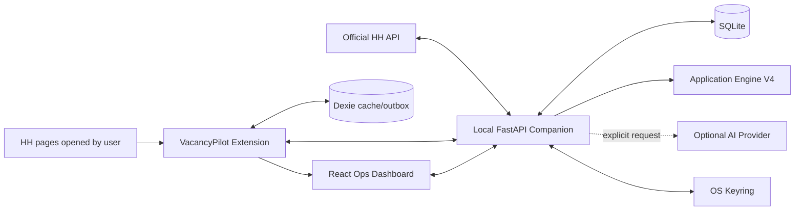
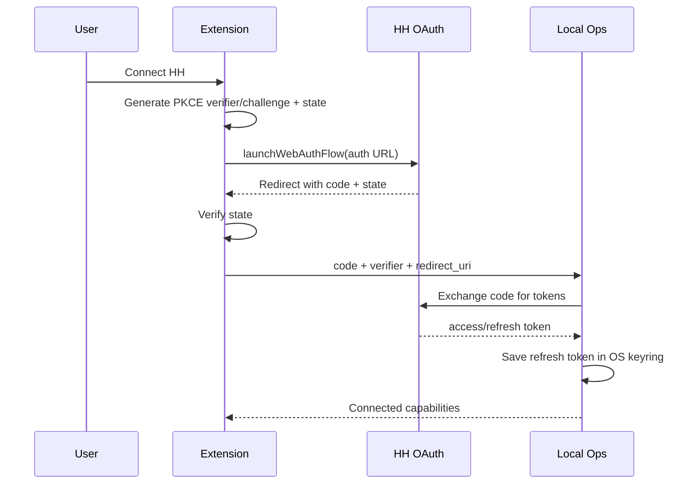

# VacancyPilot Application Ops — полный MVP

## 0. Резюме решения

### Что строим

**VacancyPilot Application Ops** — локальная система управления поиском работы, которая объединяет:

1. существующее браузерное расширение VacancyPilot;
2. официальный HH API с application token и OAuth пользователя;
3. Application Engine V4 для точного анализа вакансий и подготовки откликов;
4. локальную CRM откликов;
5. follow-up и Interview Pack;
6. аналитику конверсии и качества писем;
7. контролируемый human-in-the-loop workflow без auto-apply.

### Главная продуктовая формула

```text
HH API + открытая пользователем страница
→ intake и дедупликация
→ быстрый rule-based triage
→ Application Engine V4
→ review и редактирование
→ пользователь отправляет отклик
→ синхронизация статуса
→ follow-up / интервью
→ outcome analytics
→ улучшение следующей версии движка
```

### Ключевое архитектурное решение

Не создавать отдельный Streamlit-дашборд и не дублировать существующий интерфейс.

Существующий VacancyPilot уже имеет:

- popup;
- side panel;
- full-page dashboard;
- Kanban;
- локальную базу Dexie/IndexedDB;
- rule-based scoring;
- Cover Letter Studio;
- OpenAI BYOK;
- HR timeline;
- reminders;
- JSON/CSV export;
- release-safety tests.

Поэтому:

- **React/WXT extension** остаётся основным интерфейсом;
- **локальный FastAPI companion** добавляется как вычислительный и интеграционный слой;
- **SQLite** хранит operational data, engine runs и аналитику;
- **Dexie** сохраняется как browser cache, offline capture и migration source;
- **никакого облачного backend** в MVP нет.

---

# 1. Исходная точка

## 1.1. Что уже реализовано в VacancyPilot

Подтверждённый baseline репозитория:

| Область | Текущее состояние |
|---|---|
| Extension framework | WXT, Manifest V3 |
| UI | React 19 |
| Язык | TypeScript |
| Browser storage | Dexie / IndexedDB и `chrome.storage.local` |
| HH page intake | Visible-page parser |
| Search pages | Quick save/reject, badges/highlights |
| Vacancy score | Explainable rule-based score |
| Vacancy lifecycle | Local statuses и status history |
| Dashboard | Vacancies, Summary, Applications, Companies |
| Pipeline | Kanban |
| Profile data | Profiles и resumes |
| Letters | Cover Letter Studio, versions, final state |
| AI | OpenAI BYOK, payload preview, cache, budget checks |
| HR workflow | Passive HH status и HR timeline |
| Reminders | Daily summary и next-action reminders |
| Export | JSON и CSV |
| Safety | No auto-submit, no hidden HH fetch, release-safety tests |

## 1.2. Что уже реализовано в Application Engine V4

Application Engine V4 содержит:

- 119 подтверждённых candidate claims;
- 15 commercial cases;
- 20 portfolio cases;
- evidence levels `E4/E3/E2/P1/X0/N0`;
- hard gates;
- remote eligibility;
- score caps;
- human voice;
- portfolio boundaries;
- semantic opening/closing rotation;
- literal Section 3 validation;
- 15 regression scenarios;
- 6 smoke scenarios;
- production pilot tooling.

## 1.3. Главный разрыв

Сейчас две сильные системы существуют отдельно:

```text
VacancyPilot
= intake + tracking + browser UX

Application Engine V4
= evidence-aware analysis + positioning + QA
```

MVP должен соединить их в один operational workflow.

---

# 2. Цели MVP

## 2.1. Пользовательская цель

Пользователь должен иметь возможность:

1. увидеть новую вакансию на HH или получить её через официальный API;
2. быстро понять, стоит ли тратить время;
3. запустить полный V4-анализ;
4. получить объяснимый score и evidence map;
5. подготовить и проверить письмо;
6. сохранить фактически отправленную версию;
7. вести статус отклика;
8. не пропустить follow-up;
9. получить Interview Pack;
10. видеть, какие вакансии, письма и доказательства реально дают ответы.

## 2.2. Бизнес-цель

Сократить ручную работу и повысить качество решений:

```text
меньше случайных откликов
+ меньше ручного переписывания
+ меньше неподтверждённых claims
+ выше recruiter response rate
+ лучше подготовка к интервью
```

## 2.3. Целевые показатели MVP

Это целевые критерии, а не уже достигнутые результаты.

| Метрика | Цель MVP |
|---|---:|
| Открытая вакансия → быстрый triage | до 10 секунд |
| Открытая вакансия → полный V4 draft | до 120 секунд |
| Дубликаты вакансий | менее 1% |
| Unsupported direct claims | 0 |
| QA false PASS | 0 |
| Вакансии без сохранённого решения | менее 10% |
| Отправленные отклики без final letter snapshot | 0 |
| Просроченные follow-up без уведомления | 0 |
| Ручная правка письма | измеряется автоматически |
| Production pilot | 15–20 реальных откликов |

---

# 3. Границы MVP

## 3.1. Входит в MVP

### P0 — обязательное ядро

- переиспользование существующего VacancyPilot;
- локальный FastAPI companion;
- SQLite operational database;
- pairing extension ↔ localhost;
- загрузка и проверка Application Engine V4;
- intake вакансии из открытой страницы;
- intake через официальный HH API;
- application token;
- OAuth пользователя с PKCE;
- синхронизация аккаунта, резюме и доступных applicant responses;
- rule-based shortlist;
- полный V4-анализ по кнопке;
- evidence trace;
- V4 Cover Letter Studio;
- generated vs sent diff;
- pipeline;
- follow-up;
- Interview Pack;
- analytics dashboard;
- backup/export;
- automated tests;
- no auto-apply.

### P1 — включается при сохранении сроков

- ежедневная синхронизация HH search profiles;
- desktop/browser notifications;
- detailed read-only negotiation timeline;
- manual ChatGPT Project bridge;
- experiments metadata для openings/closings;
- dashboard filtering by source, role family и score band.

## 3.2. Не входит в MVP

- автоматическая отправка отклика;
- автоматическое заполнение формы HH;
- автоматические сообщения рекрутерам;
- скрытые или неофициальные endpoint’ы HH;
- обход CAPTCHA или rate limits;
- массовый scraper;
- cloud backend;
- многопользовательский режим;
- мобильное приложение;
- Kubernetes;
- микросервисы;
- Kafka/RabbitMQ;
- отдельный React web frontend;
- Streamlit;
- ML-модель для автоматической перекалибровки score;
- автоматическое изменение candidate claims;
- публикация в Chrome Web Store;
- полная поддержка LinkedIn/Rabota.md;
- Gmail/Telegram sync.

---

# 4. Продуктовые принципы

## 4.1. Human in control

```text
System prepares
→ user reviews
→ user copies/sends
→ system records
```

Внешнее действие всегда остаётся за пользователем.

## 4.2. Official API first

Для HH используются:

- официальные public API endpoints;
- application token;
- OAuth2 пользователя;
- обязательный `HH-User-Agent`;
- documented pagination;
- backoff на `429`;
- capability discovery после авторизации.

Не используются:

- cookies HH;
- browser session token;
- private endpoints;
- internal frontend API;
- DOM automation для отправки.

## 4.3. Local-first

Основные данные находятся на устройстве пользователя:

- SQLite companion database;
- Dexie cache;
- OS keyring;
- local backups.

## 4.4. Evidence before wording

Письмо может быть сильным, но score и direct claims определяются только evidence.

```text
positive presentation ≠ evidence upgrade
```

## 4.5. Useful without AI

Без LLM должны работать:

- HH sync;
- intake;
- дедупликация;
- rule-based score;
- pipeline;
- follow-up;
- export;
- analytics;
- Interview Pack template.

---

# 5. Архитектура

## 5.1. Общая схема



## 5.2. Компоненты

### A. VacancyPilot Extension

Ответственность:

- page parsing;
- search badges;
- one-click intake;
- side panel;
- dashboard;
- review;
- clipboard actions;
- manual status actions;
- local notifications;
- offline queue.

### B. VacancyPilot Ops Companion

Ответственность:

- HTTP API на `127.0.0.1`;
- HH authorization;
- token refresh;
- official HH API client;
- V4 engine orchestration;
- SQLite;
- analytics;
- follow-up calculation;
- Interview Pack;
- backup;
- import/export;
- validation.

### C. Application Engine V4 Runtime

Ответственность:

- manifest verification;
- candidate knowledge loading;
- requirement extraction;
- evidence resolution;
- score/caps;
- prompt compilation;
- structured output;
- letter QA;
- evidence trace;
- run metadata.

### D. HH Adapter

Ответственность:

- application authorization;
- user OAuth;
- public vacancy search;
- vacancy details;
- dictionaries;
- current account;
- applicant resumes;
- available response/invitation collections;
- safe read-only sync;
- rate-limit handling.

### E. Analytics Layer

Ответственность:

- funnel;
- response rate;
- stage conversion;
- score calibration;
- edit rate;
- evidence performance;
- rejection reasons;
- follow-up effectiveness.

---

# 6. Почему нужен local companion

## 6.1. Что нельзя качественно решить только расширением

- безопасное хранение HH refresh token;
- Application Engine V4 как versioned knowledge package;
- Python validators;
- SQLite analytics;
- prompt compilation;
- repeatable backups;
- secure secret management;
- long-running sync;
- future provider gateway.

## 6.2. Почему не cloud backend

- один пользователь;
- чувствительные карьерные данные;
- local-first philosophy;
- отсутствие server costs;
- минимум compliance surface;
- проще backup и удаление;
- можно работать offline.

## 6.3. Почему не Streamlit

VacancyPilot уже имеет полноценный React dashboard. Streamlit:

- продублирует UI;
- создаст второй state layer;
- заставит переключаться между extension и отдельным сайтом;
- усложнит синхронизацию.

Основной UI должен развиваться внутри существующего dashboard.

---

# 7. Режимы работы

## 7.1. Standalone Mode

Если companion не запущен:

- сохраняется текущий функционал;
- Dexie остаётся локальным storage;
- rule-based score работает;
- текущий OpenAI BYOK может работать;
- V4 Ops features показывают статус `Companion offline`.

## 7.2. Ops Mode

Если companion подключён:

- SQLite становится canonical operational storage;
- extension работает как capture/review client;
- V4 analysis доступен;
- HH API sync доступен;
- analytics и Interview Pack доступны;
- Dexie используется как cache/outbox.

## 7.3. Migration Mode

Первое подключение предлагает:

1. preview текущих Dexie counts;
2. export snapshot;
3. idempotent import в companion;
4. conflict report;
5. commit migration;
6. backup исходного JSON.

---

# 8. HH API и авторизация

## 8.1. Два типа авторизации

### Application token

Используется для:

- public vacancy search;
- vacancy details;
- dictionaries;
- employer public data;
- preliminary discovery.

### User OAuth token

Используется для:

- account identity;
- applicant resumes;
- доступных user-specific operations;
- read-only responses/invitations sync;
- capability discovery.

## 8.2. OAuth flow



## 8.3. Chrome permissions

Добавлять только необходимые permissions:

```json
{
  "permissions": [
    "storage",
    "sidePanel",
    "activeTab",
    "identity",
    "alarms",
    "notifications"
  ],
  "optional_host_permissions": [
    "https://api.openai.com/*",
    "http://127.0.0.1:8765/*"
  ]
}
```

HH API вызывается companion service, поэтому extension не требует широкого `api.hh.ru` host permission.

## 8.4. Token storage

Запрещено:

- хранить HH refresh token в Dexie;
- хранить client secret в extension bundle;
- экспортировать tokens;
- писать token в logs.

Разрешено:

- access token в памяти companion;
- refresh token в OS keyring;
- metadata без secret в SQLite;
- disconnect с удалением local credentials.

## 8.5. Sync policy

MVP поддерживает:

- manual sync;
- opt-in daily sync;
- no continuous polling;
- pagination limits;
- exponential backoff;
- cursor/checkpoint;
- sync run log;
- retry только для безопасных GET;
- no automatic POST to HH.

## 8.6. Negotiations/messages boundary

Applicant response sync реализуется как read-only.

Detailed message sync:

- feature flag;
- только после проверки доступности endpoint’а для user token;
- только по явному действию;
- не является acceptance blocker MVP;
- не используется для автоматической отправки сообщений.

---

# 9. Application Engine V4 Runtime

## 9.1. Engine package

```text
engine/
├─ active/
│  ├─ 00_source_manifest.md
│  ├─ 01_candidate_claims.md
│  ├─ 02_experience_case_bank.md
│  ├─ 03_portfolio_cases.md
│  ├─ 04_targeting_constraints.md
│  ├─ 05_voice_and_gold_examples.md
│  ├─ 07_project_master_instruction.md
│  ├─ 08_candidate_updates.md
│  ├─ 09_skill_calibration_matrix.md
│  └─ 11_letter_regression_suite.md
├─ PROJECT_INSTRUCTIONS_READY_TO_PASTE_V4.md
├─ manifest.json
└─ checksums.sha256
```

## 9.2. Engine boot check

При запуске companion:

1. проверить files;
2. проверить hashes;
3. распарсить frontmatter;
4. проверить versions;
5. проверить unique IDs;
6. проверить authority graph;
7. показать status в Engine Health.

Если engine invalid:

- rule-based features продолжают работать;
- V4 analysis блокируется;
- пользователь получает точную ошибку.

## 9.3. Двухступенчатый анализ

### Stage A — Local Triage

Без LLM:

- hard gates;
- format;
- location;
- salary;
- title match;
- keyword match;
- known skills;
- duplicates;
- company blacklist;
- preliminary score.

### Stage B — Full V4 Analysis

Только по кнопке или для shortlist:

- role shape;
- 3 central requirements;
- evidence resolution;
- score caps;
- letter strategy;
- letter;
- 2 recruiter risks;
- QA;
- interview prep.

## 9.4. Prompt compiler

Не отправлять весь knowledge pack в каждом запросе.

Compiler формирует минимальный bundle:

```yaml
vacancy:
  normalized_fields:
  full_text:

candidate:
  selected_claims:
  selected_commercial_cases:
  selected_portfolio_case:
  skill_calibration:

rules:
  targeting_subset:
  voice_subset:
  regression_subset:
  project_instructions:
```

## 9.5. Structured output

LLM возвращает JSON:

```json
{
  "vacancy_identity": {
    "company": "",
    "role": ""
  },
  "eligibility": {
    "format": "",
    "hard_fail": false,
    "reasons": []
  },
  "central_requirements": [],
  "evidence_map": [],
  "score": {
    "raw": 0,
    "caps": [],
    "final": 0,
    "confidence": "HIGH",
    "decision": ""
  },
  "strategy": {},
  "cover_letter": "",
  "recruiter_risks": [],
  "interview_prep": [],
  "qa": {}
}
```

## 9.6. Validators

До сохранения final result:

- H1;
- 5 sections;
- 150–220 words;
- hard-fail fallback 90–130;
- two vacancy anchors;
- micro-proof;
- exactly 2 recruiter risks;
- signature;
- whitespace only after signature;
- no placeholders;
- no meta-text;
- no forbidden phrases;
- no hidden self-disqualification;
- no unsupported direct claims;
- list density;
- score caps;
- English mode.

Один repair retry разрешён. Если повторно FAIL:

- сохранить draft как invalid;
- показать validation errors;
- не помечать letter ready.

---

# 10. AI execution modes

## 10.1. OpenAI BYOK

Primary automated mode:

- key хранится в OS keyring companion;
- payload preview;
- token/cost estimate;
- model configurable;
- structured output;
- local cache;
- explicit user action.

## 10.2. Manual ChatGPT Project Bridge

Fallback без API:

1. система формирует готовый analysis prompt;
2. пользователь копирует его;
3. вставляет в ChatGPT Project с V4 sources;
4. копирует ответ;
5. вставляет в VacancyPilot;
6. local validator проверяет ответ;
7. результат сохраняется.

MVP UI:

```text
[Generate via API]
[Copy prompt for ChatGPT]
[Import ChatGPT response]
```

## 10.3. Provider abstraction

```python
class LLMProvider:
    analyze_vacancy(...)
    generate_letter(...)
    repair_output(...)
```

MVP:

- OpenAI;
- Manual bridge.

Позже:

- OpenRouter;
- DeepSeek;
- local model.

---

# 11. Основные пользовательские сценарии

## 11.1. Вакансия открыта на HH

1. Content script извлекает visible data.
2. VacancyPilot показывает badge.
3. Пользователь нажимает `Save & analyze`.
4. Extension отправляет normalized DTO в companion.
5. Companion выполняет idempotent upsert.
6. Local triage возвращает score.
7. Side panel показывает решение.
8. Пользователь запускает V4 analysis.
9. Result сохраняется.
10. Vacancy попадает в Inbox/Pipeline.

## 11.2. Поиск через официальный HH API

1. Пользователь создаёт Search Profile.
2. Выбирает manual или daily sync.
3. Companion вызывает official search.
4. Новые вакансии дедуплицируются.
5. Stage A score применяется ко всем.
6. В Inbox попадают top candidates.
7. Full V4 запускается вручную или batch для top N.

## 11.3. Подготовка письма

1. Открыть Application Card.
2. Просмотреть requirements/evidence.
3. Запустить generation.
4. Получить validation report.
5. Редактировать.
6. Сохранить `generated`.
7. Сохранить `sent`.
8. Система считает diff.
9. Пользователь вручную отправляет письмо.
10. Status → `APPLIED`.

## 11.4. Статус синхронизирован из HH

1. Пользователь запускает sync.
2. Companion получает доступные responses.
3. Match по vacancy ID.
4. Создаётся application event.
5. Система предлагает status update.
6. Автоматический update разрешён только для однозначного read-only signal.
7. Все изменения видны в timeline.

## 11.5. Follow-up

1. При `APPLIED` создаётся next action.
2. Через configurable delay появляется reminder.
3. Система генерирует follow-up draft.
4. Пользователь редактирует и отправляет вручную.
5. Event сохраняется.

## 11.6. Интервью

1. Status → `INTERVIEW`.
2. Пользователь нажимает `Generate Interview Pack`.
3. Система создаёт role summary, evidence map, likely questions, risky claims, 90-second intro, questions to employer и first-task hypothesis.
4. Pack сохраняется и экспортируется в Markdown.

## 11.7. Outcome

1. Пользователь фиксирует ответ.
2. Application event сохраняется.
3. Funnel обновляется.
4. Analytics связывает outcome со score, proof и letter strategy.
5. После 15–20 applications формируется pilot report.

---

# 12. Dashboard MVP

## 12.1. Новая навигация

```text
WORK
├─ Command Center
├─ Inbox
├─ Pipeline
├─ Follow-ups
├─ Interviews
└─ Analytics

KNOWLEDGE
├─ Profiles
├─ Resumes
├─ Evidence
└─ Engine Health

SYSTEM
├─ HH Integration
├─ AI Providers
├─ Import / Export
├─ Privacy
└─ Settings
```

## 12.2. Command Center

Показывает:

- new vacancies;
- high-priority vacancies;
- ready-to-send;
- follow-ups due;
- unread/updated HH responses;
- upcoming interviews;
- missing outcomes;
- companion/engine/HH health.

## 12.3. Inbox

Фильтры:

- source;
- search profile;
- score;
- decision;
- work mode;
- salary;
- role family;
- date;
- duplicate;
- analysis status.

Bulk actions:

- analyze selected;
- save;
- reject;
- archive;
- assign role family.

## 12.4. Application Card

Вкладки:

1. Overview
2. Vacancy
3. Evidence
4. Score
5. Letter
6. Timeline
7. Follow-up
8. Interview
9. Debug

## 12.5. Pipeline

```text
NEW
SAVED
ANALYZED
READY_TO_SEND
APPLIED
HR_REPLIED
INTERVIEW
TEST_TASK
OFFER
REJECTED_BY_COMPANY
REJECTED_BY_ME
ARCHIVED
```

## 12.6. Follow-ups

Показывает:

- due today;
- overdue;
- waiting for promised date;
- after interview;
- after test task.

## 12.7. Analytics

MVP charts/tables:

- funnel;
- applications by week;
- response rate;
- conversion by score band;
- conversion by role family;
- conversion by source;
- manual edit rate;
- proof performance;
- recruiter challenge rate;
- rejection reasons;
- median response time.

## 12.8. Engine Health

```text
Engine version
Active files
Manifest status
Claims count
Commercial cases
Portfolio cases
Regression status
Last successful run
Provider status
HH connection
Database backup
```

---

# 13. Generated vs Sent Diff

## 13.1. Зачем

Это главный feedback signal для V4.1.

## 13.2. Что сохраняем

- generated text;
- final sent text;
- timestamps;
- word count;
- changed sentences;
- removed phrases;
- added phrases;
- edit ratio;
- opening changed;
- closing changed;
- gap text removed;
- claim softened/strengthened.

## 13.3. Метрики

```text
manual_edit_ratio
opening_edit_rate
closing_edit_rate
claim_edit_rate
average_words_added
average_words_removed
```

## 13.4. Ограничение

Система не должна автоматически делать вывод, что ручная правка «лучше». Она только фиксирует факт.

---

# 14. Interview Pack

## 14.1. Состав

```text
interview-pack/
├─ 00_role_summary.md
├─ 01_evidence_map.md
├─ 02_likely_questions.md
├─ 03_risky_claims.md
├─ 04_case_answers.md
├─ 05_90_second_intro.md
├─ 06_questions_to_employer.md
├─ 07_first_task_hypothesis.md
└─ 08_company_notes.md
```

## 14.2. Evidence-aware questions

Для каждого central `E2/P1`:

- что могут спросить;
- безопасная формулировка;
- что нельзя утверждать;
- bridge;
- related commercial case.

## 14.3. Company notes

В MVP:

- ручное поле;
- данные из vacancy/employer public API;
- без web research automation.

---

# 15. Данные и модель

## 15.1. SQLite tables

### `vacancies`

```text
id
source
source_vacancy_id
url
title
company_id
company_name
salary_min
salary_max
currency
work_mode
experience
description
description_hash
skills_json
first_seen_at
last_seen_at
updated_at
archived
```

Unique:

```text
(source, source_vacancy_id)
```

### `vacancy_snapshots`

```text
id
vacancy_id
description_hash
payload_json
captured_at
capture_source
```

### `applications`

```text
id
vacancy_id
status
decision
score
confidence
primary_proof
selected_profile_id
selected_resume_id
applied_at
next_action_at
created_at
updated_at
```

### `application_events`

```text
id
application_id
event_type
source
payload_json
occurred_at
created_at
```

### `engine_runs`

```text
id
vacancy_id
engine_version
provider
model
prompt_version
input_hash
raw_output
validated_output
status
validation_errors_json
token_input
token_output
estimated_cost
created_at
```

### `evidence_usage`

```text
id
engine_run_id
requirement
evidence_level
claim_id
case_id
portfolio_id
allowed_wording
```

### `cover_letters`

```text
id
application_id
mode
generated_text
sent_text
is_final
created_at
updated_at
```

### `letter_versions`

```text
id
cover_letter_id
version_type
body_text
source
provider
model
prompt_version
created_at
```

### `followups`

```text
id
application_id
reason
due_at
status
draft_text
sent_at
created_at
updated_at
```

### `interview_packs`

```text
id
application_id
engine_run_id
content_json
export_path
created_at
updated_at
```

### `hh_accounts`

Без secrets:

```text
id
hh_user_id
display_name
connected
capabilities_json
last_sync_at
```

### `hh_sync_runs`

```text
id
sync_type
status
items_seen
items_created
items_updated
error_summary
started_at
finished_at
```

### `search_profiles`

```text
id
name
query_json
enabled
schedule
last_run_at
```

### `settings`

```text
key
value_json
updated_at
```

## 15.2. Dexie schema extension

Новый schema version:

```text
syncOutbox
opsCache
opsMeta
```

### `syncOutbox`

```text
&id, entityType, operation, createdAt, retryCount
```

## 15.3. Conflict policy

Append-only:

- events;
- letter versions;
- engine runs;
- snapshots.

Last-write with revision:

- application status;
- settings;
- selected profile.

Никакой silent destructive merge.

---

# 16. Local API contract

Base:

```text
http://127.0.0.1:8765/api/v1
```

## 16.1. Health

```text
GET /health
GET /engine/status
GET /integrations/hh/status
GET /providers/status
```

## 16.2. Pairing

```text
POST /pair/start
POST /pair/confirm
POST /pair/revoke
```

## 16.3. HH

```text
POST /hh/auth/start
POST /hh/auth/exchange
POST /hh/auth/disconnect
POST /hh/sync/vacancies
POST /hh/sync/resumes
POST /hh/sync/negotiations
GET  /hh/capabilities
```

## 16.4. Vacancies

```text
POST /vacancies/intake
GET  /vacancies
GET  /vacancies/{id}
POST /vacancies/{id}/triage
POST /vacancies/{id}/analyze
POST /vacancies/{id}/archive
```

## 16.5. Letters

```text
POST /applications/{id}/letters/generate
POST /applications/{id}/letters/import
PUT  /applications/{id}/letters/final
GET  /applications/{id}/letters/diff
```

## 16.6. Applications

```text
GET  /applications
POST /applications
PATCH /applications/{id}
POST /applications/{id}/events
```

## 16.7. Follow-ups

```text
GET  /followups
POST /followups
PATCH /followups/{id}
POST /followups/{id}/generate
```

## 16.8. Interviews

```text
POST /applications/{id}/interview-pack
GET  /applications/{id}/interview-pack
POST /applications/{id}/interview-pack/export
```

## 16.9. Analytics

```text
GET /analytics/overview
GET /analytics/funnel
GET /analytics/score-bands
GET /analytics/proofs
GET /analytics/edit-rate
GET /analytics/rejections
```

## 16.10. Backup

```text
POST /backup/create
POST /backup/restore-preview
POST /backup/restore
GET  /export/json
GET  /export/csv
```

---

# 17. Pairing extension ↔ companion

## 17.1. Threat model

Localhost API может быть вызван другим сайтом, если защита слабая.

## 17.2. Защита

- bind only `127.0.0.1`;
- no `0.0.0.0`;
- strict CORS;
- allow exact extension origin;
- random pairing secret;
- client token;
- no wildcard origins;
- request size limits;
- rate limiting;
- content type validation;
- no tokens in response;
- no sensitive logs.

## 17.3. Pairing flow

1. Companion показывает six-digit code.
2. Extension вводит code.
3. Companion выдаёт random client token.
4. Extension хранит token локально.
5. Каждый request содержит:

```text
X-VacancyPilot-Client
X-VacancyPilot-Request-ID
```

6. Token можно revoke.

---

# 18. Security и privacy

## 18.1. Secrets

OS keyring:

- HH refresh token;
- HH application token;
- OpenAI key;
- pairing secret.

SQLite:

- только references и non-secret metadata.

## 18.2. Logging

Redact:

- Authorization;
- tokens;
- email;
- phone;
- URLs with credentials;
- resume contacts;
- raw provider payload when privacy mode enabled.

## 18.3. Payload preview

Перед AI request пользователь видит:

- vacancy text;
- selected evidence;
- resume highlights;
- exclusions;
- provider;
- model;
- estimated tokens/cost.

## 18.4. Backup

По умолчанию backup не включает secrets.

## 18.5. Privacy policy update

До публичного релиза политика должна отражать:

- local companion;
- localhost communication;
- HH API;
- OAuth;
- OS keyring;
- optional AI providers;
- no developer-operated cloud backend.

---

# 19. Observability

## 19.1. Local run log

```text
request_id
operation
status
duration_ms
records
provider
error_code
created_at
```

## 19.2. No telemetry by default

Никакие данные не отправляются разработчику.

## 19.3. Debug bundle

Пользователь может создать sanitized support bundle:

- versions;
- schema;
- health;
- recent error codes;
- no vacancy text;
- no letters;
- no secrets.

---

# 20. Testing strategy

## 20.1. Extension

- Vitest unit tests;
- component tests;
- WXT build;
- release-safety;
- Manifest permission snapshot;
- content script safety;
- parser fixtures.

## 20.2. Companion

- pytest;
- Ruff;
- mypy;
- FastAPI TestClient;
- SQLite migration tests;
- OAuth state/PKCE tests;
- token redaction tests;
- API contract tests;
- backup/restore tests.

## 20.3. HH contract tests

С реальными tokens только manual/opt-in:

- application auth;
- `/me`;
- resumes;
- vacancy search/detail;
- negotiations capability;
- disconnect/refresh;
- 401/403/429.

Secrets не попадают в CI.

## 20.4. Engine tests

- current 15 regressions;
- current 6 smoke tests;
- prompt compiler snapshots;
- evidence trace;
- score cap parity;
- letter validator;
- repair retry;
- invalid package boot.

## 20.5. E2E

Chrome manual/E2E:

1. open vacancy;
2. save;
3. companion intake;
4. triage;
5. analyze;
6. edit letter;
7. save final;
8. mark applied;
9. follow-up;
10. interview pack;
11. export;
12. restore.

## 20.6. Fixtures

MVP target:

- 25 sanitized vacancy fixtures;
- 6 HH page variants;
- 6 engine smoke fixtures;
- 5 OAuth error fixtures;
- 5 status sync fixtures.

---

# 21. Repository structure

Существующий repo не переносить в новый monorepo.

Добавить:

```text
VacancyPilot/
├─ entrypoints/                 # existing
├─ src/                         # existing extension
├─ companion/
│  ├─ pyproject.toml
│  ├─ README.md
│  ├─ app/
│  │  ├─ main.py
│  │  ├─ api/
│  │  ├─ db/
│  │  ├─ engine/
│  │  ├─ hh/
│  │  ├─ providers/
│  │  ├─ analytics/
│  │  ├─ security/
│  │  └─ services/
│  ├─ migrations/
│  └─ tests/
├─ engine/
│  ├─ active/
│  ├─ manifest.json
│  └─ checksums.sha256
├─ shared/
│  ├─ contracts/
│  └─ schemas/
├─ docs/
│  ├─ mvp/
│  ├─ architecture/
│  └─ operations/
├─ scripts/
├─ tests/
└─ package.json
```

---

# 22. Technology stack

## Extension

```text
WXT
Manifest V3
TypeScript
React 19
Dexie
Vitest
ESLint
```

## Companion

```text
Python 3.12+
FastAPI
Pydantic v2
SQLAlchemy 2
Alembic
SQLite
httpx
keyring
pytest
Ruff
mypy
uv
```

## Optional

```text
DuckDB — только для сложной offline analytics позже
PyInstaller — packaging после dogfood
```

## Не добавлять

```text
Celery
Redis
Kafka
Docker requirement
PostgreSQL
Kubernetes
```

MVP должен запускаться без Docker.

---

# 23. Implementation backlog

## Epic 0 — Baseline preservation

### MVP-0001

Зафиксировать repository baseline и current tests.

Acceptance:

- `pnpm verify` PASS;
- `pnpm test:release` PASS;
- current export snapshot;
- branch `feat/application-ops-mvp`.

### MVP-0002

Создать architecture decision records.

## Epic 1 — Companion foundation

### MVP-0101

Создать `companion/` с `uv`, FastAPI и health endpoint.

### MVP-0102

SQLite schema и Alembic.

### MVP-0103

Strict localhost/CORS/pairing.

### MVP-0104

OS keyring abstraction.

### MVP-0105

Structured logging и redaction.

Acceptance:

```text
GET /health → PASS
pairing → PASS
secret never appears in logs
database migration → PASS
```

## Epic 2 — Extension integration

### MVP-0201

Companion settings section.

### MVP-0202

Pair/connect/disconnect UI.

### MVP-0203

`OpsClient` TypeScript adapter.

### MVP-0204

Dexie outbox.

### MVP-0205

Current vacancy intake.

Acceptance:

- extension works with companion offline;
- online intake idempotent;
- no duplicate vacancy;
- retry after reconnect.

## Epic 3 — Application Engine V4

### MVP-0301

Engine package loader.

### MVP-0302

Manifest/hash validation.

### MVP-0303

Knowledge index and evidence resolver.

### MVP-0304

Prompt compiler.

### MVP-0305

Structured LLM output.

### MVP-0306

Validators and repair retry.

### MVP-0307

Engine Health UI.

Acceptance:

- 15 regressions PASS;
- 6 smoke tests PASS;
- unsupported claims 0;
- invalid engine package blocks analysis.

## Epic 4 — HH API

### MVP-0401

Application token configuration.

### MVP-0402

Official vacancy search/detail client.

### MVP-0403

OAuth PKCE.

### MVP-0404

Token refresh/keyring.

### MVP-0405

Account/resume sync.

### MVP-0406

Applicant negotiations capability sync.

### MVP-0407

Search profiles.

Acceptance:

- connect/disconnect PASS;
- no secret in browser storage;
- `HH-User-Agent` sent;
- 401 refresh behavior tested;
- 429 backoff tested;
- no POST application action.

## Epic 5 — Operations dashboard

### MVP-0501

Command Center.

### MVP-0502

Inbox.

### MVP-0503

Application Card with evidence.

### MVP-0504

Pipeline.

### MVP-0505

Follow-ups.

### MVP-0506

Interview Pack.

### MVP-0507

Analytics.

Acceptance:

- all pages use Ops API;
- no duplicate dashboard;
- loading/error/empty states;
- responsive layout;
- keyboard-accessible critical actions.

## Epic 6 — Letter workflow

### MVP-0601

V4 generation.

### MVP-0602

Manual ChatGPT bridge.

### MVP-0603

Generated/final/sent snapshots.

### MVP-0604

Diff metrics.

### MVP-0605

Copy/review gate.

Acceptance:

- final letter cannot be saved with QA FAIL;
- sent snapshot immutable;
- diff generated;
- no automatic HH form write.

## Epic 7 — Analytics and pilot

### MVP-0701

Funnel metrics.

### MVP-0702

Score band conversion.

### MVP-0703

Proof performance.

### MVP-0704

Manual edit rate.

### MVP-0705

Pilot export/report.

Acceptance:

- zero-row dataset handled;
- small sample warning;
- no automatic weight change;
- 20-application pilot workspace export.

## Epic 8 — Backup and release

### MVP-0801

Portable backup.

### MVP-0802

Restore preview.

### MVP-0803

Sanitized debug bundle.

### MVP-0804

Manual Chrome/Edge QA.

### MVP-0805

MVP release package.

---

# 24. Implementation phases

## Phase 0 — Discovery and integration design

Effort: 2–3 development days.

Result:

- ADRs;
- API contract;
- schema;
- baseline;
- no product behavior changes.

## Phase 1 — Companion + pairing

Effort: 4–6 days.

Result:

- local service;
- SQLite;
- keyring;
- extension connection;
- intake.

## Phase 2 — Engine V4 integration

Effort: 5–8 days.

Result:

- full analysis;
- letter;
- evidence map;
- validators.

## Phase 3 — HH API/OAuth

Effort: 5–8 days.

Result:

- discovery;
- connect;
- sync;
- resumes;
- responses capability.

## Phase 4 — Dashboard workflow

Effort: 6–10 days.

Result:

- Command Center;
- Inbox;
- Pipeline;
- Follow-ups;
- Interviews;
- Analytics.

## Phase 5 — Hardening and dogfood

Effort: 4–7 days.

Result:

- fixtures;
- E2E;
- backup;
- 15–20 application pilot.

Total engineering estimate:

```text
26–42 focused development days
```

При активном Codex-assisted development возможен меньший calendar time, но scope не сокращается автоматически.

---

# 25. MVP acceptance criteria

## 25.1. Functional

- [ ] Open HH vacancy can be saved to Ops.
- [ ] Duplicate upsert is idempotent.
- [ ] Official HH search works with application token.
- [ ] OAuth connect/disconnect works.
- [ ] Token refresh works.
- [ ] Resumes sync.
- [ ] Available applicant response sync.
- [ ] Local triage works without AI.
- [ ] V4 full analysis works.
- [ ] Evidence map is visible.
- [ ] Score caps match V4.
- [ ] Letter validation is literal.
- [ ] Generated and sent versions are separate.
- [ ] Pipeline works.
- [ ] Follow-up reminders work.
- [ ] Interview Pack exports.
- [ ] Analytics handles empty and populated data.
- [ ] Backup and restore preview work.

## 25.2. Safety

- [ ] No auto-apply.
- [ ] No hidden HH requests.
- [ ] No HH cookies/session access.
- [ ] No broad HH permissions.
- [ ] No refresh token in extension storage.
- [ ] No secrets in export.
- [ ] No secrets in logs.
- [ ] No unsupported claims.
- [ ] No cloud backend.
- [ ] Companion binds only loopback.

## 25.3. Quality

- [ ] Extension typecheck PASS.
- [ ] Extension lint PASS.
- [ ] Extension tests PASS.
- [ ] Extension build PASS.
- [ ] Release-safety PASS.
- [ ] Companion pytest PASS.
- [ ] Ruff PASS.
- [ ] mypy PASS.
- [ ] Engine regressions 15/15.
- [ ] Engine smoke 6/6.
- [ ] Chrome manual QA PASS.
- [ ] Edge manual QA PASS.
- [ ] 25 parser fixtures PASS.

## 25.4. Pilot exit

- [ ] 15–20 real applications logged.
- [ ] Generated and sent letters stored.
- [ ] Manual edit rate calculated.
- [ ] Outcomes recorded.
- [ ] No critical claim incident.
- [ ] V4.1 recommendations based on batch data.

---

# 26. Release definition

## MVP release name

```text
VacancyPilot Application Ops 0.2.0
```

Почему не `1.0`:

- private dogfood;
- single-user;
- HH API behavior требует live verification;
- local companion packaging ещё не public-ready.

## Release artifacts

```text
dist/
├─ extension-chrome/
├─ extension-edge/
├─ companion/
├─ engine/
├─ install.ps1
├─ uninstall.ps1
├─ README.md
├─ PRIVACY.md
├─ SECURITY.md
├─ CHECKSUMS_SHA256.txt
└─ VACANCYPILOT_APPLICATION_OPS_MVP.zip
```

---

# 27. Основные риски

## R1 — OAuth redirect compatibility

Риск:

- dev extension ID и production ID различаются;
- redirect URI нужно регистрировать.

Митигирование:

- stable extension key;
- separate dev/prod HH apps;
- PKCE;
- documented callback test.

## R2 — Applicant negotiations API coverage

Риск:

- некоторые chat/negotiation методы ограничены или deprecated.

Митигирование:

- capability discovery;
- read-only scope;
- detailed messages не являются P0 blocker;
- manual HR timeline parser остаётся fallback.

## R3 — Dual storage

Риск:

- Dexie и SQLite расходятся.

Митигирование:

- clear authority in Ops mode;
- append-only events;
- idempotent upsert;
- outbox;
- migration report;
- no silent merge.

## R4 — Prompt cost

Риск:

- полный knowledge pack слишком большой.

Митигирование:

- prompt compiler;
- evidence retrieval;
- input hash/cache;
- Stage A before Stage B;
- top-N analysis.

## R5 — Letter hallucination

Митигирование:

- evidence IDs;
- whitelist;
- structured output;
- literal validators;
- repair retry;
- human review.

## R6 — Localhost attack surface

Митигирование:

- loopback only;
- strict CORS;
- pairing token;
- no wildcard;
- request limits;
- no token endpoints exposed to extension.

## R7 — Scope creep

Митигирование:

- no Streamlit;
- no cloud;
- no auto-apply;
- no multi-site;
- P0/P1 boundary;
- release only after acceptance.

---

# 28. Что даст максимальную отдачу

| Приоритет | Возможность | Эффект |
|---:|---|---|
| 1 | V4 analysis inside existing side panel | Сильный отклик без переключения систем |
| 2 | Official HH API intake | Ежедневный shortlist без ручного поиска |
| 3 | Generated vs sent diff | Объективные данные для V4.1 |
| 4 | Pipeline + follow-up | Меньше потерянных возможностей |
| 5 | Interview Pack | Конверсия после приглашения |
| 6 | Analytics | Понимание, что реально работает |
| 7 | OAuth response sync | Меньше ручного статуса |
| 8 | Manual ChatGPT bridge | Работа без API бюджета |

---

# 29. Следующие версии

## 0.3

- Gmail read-only import;
- Telegram notification;
- Rabota.md manual intake;
- n8n webhook;
- richer charts.

## 0.4

- browser extension intake adapters;
- LinkedIn copy intake;
- experiment center;
- score calibration recommendations.

## 0.5

- packaged desktop companion;
- automatic update;
- encrypted portable backup;
- local model provider.

## 1.0

Только после:

- 100+ tracked vacancies;
- 30+ applications;
- stable OAuth;
- no critical data loss;
- public privacy/security review;
- installer;
- broader QA.

---

# 30. Итоговое определение MVP

VacancyPilot Application Ops MVP считается готовым, когда пользователь может пройти весь путь:

```text
Найти вакансию через HH API или открыть её в браузере
→ получить быстрый triage
→ запустить Application Engine V4
→ увидеть evidence и score
→ подготовить и проверить письмо
→ сохранить фактически отправленную версию
→ вести статус и follow-up
→ подготовиться к интервью
→ зафиксировать outcome
→ увидеть аналитику партии
```

При этом:

```text
auto-apply = 0
hidden HH requests = 0
unsupported claims = 0
cloud backend = 0
lost application history = 0
```

Это и есть сильный MVP с максимальной практической отдачей: не новый демонстрационный dashboard, а единая local-first система, которая соединяет поиск, решение, отклик, сопровождение и обучение на реальных результатах.
